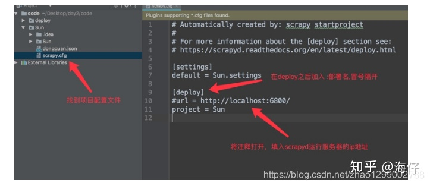

# spider-service
爬虫

1. 启动 mysql

1. qidong proxy_pool

1. Make sure that Scrapyd has been installed and started on all of your hosts. 
Note that if you want to visit your Scrapyd server remotely, you have to manually set the bind_address to bind_address = 0.0.0.0 and restart Scrapyd to make it visible externally.
```sh
scrapyd 
```

2. scrapyd的安装
scrapyd服务: pip install scrapyd
scrapyd客户端: pip install scrapyd-client

3. 启动scrapyd服务
在scrapy项目路径下 启动scrapyd的命令：sudo scrapyd 或 scrapyd
   
4. scrapy项目部署
4.1 配置需要部署的项目
编辑需要部署的项目的scrapy.cfg文件(需要将哪一个爬虫部署到scrapyd中，就配置该项目的该文件)

[deploy:部署名(部署名可以自行定义)] url = http://localhost:6800/ project = 项目名(创建爬虫项目时使用的名称)



4.2 部署项目到scrapyd
同样在scrapy项目路径下执行：

scrapyd-deploy 部署名(配置文件中设置的名称) -p 项目名称

4.3 管理scrapy项目
启动项目：curl http://localhost:6800/schedule.json -d project=project_name -d spider=spider_name


2. Install ScrapydWeb on one of your hosts via the pip install scrapydweb command.


3. Start ScrapydWeb via command scrapydweb. (a config file would be generated for customizing settings on the first startup.)

Enable HTTP basic auth (optional).

Visit http://127.0.0.1:5000, and log in with the USERNAME/PASSWORD above.

## 工作爬虫
1. 启动mongo
```
rm -rf /data/db/* 
/usr/local/mongodb/bin/mongod --dbpath=/data/db/ --logpath=/logs/mongodb.log --logappend &
```

###  股票数据

【1】 获取股票交易日列表
```
scrapy crawl trade_days -a start_year=2011 -a end_year=2021
```

[2] 获取股票基本信息
scrapy crawl stock_info

[3] 股票板块数据


[4] 股票行业列表

[5] 股票概念数据


[6] 股票日线数据
```
scrapy crawl stock_daily_163 -a start_date=20210101 -a end_date=20210526
```

[7] 资金流入流出


### 指数数据

[1] 获取指数基本信息
scrapy crawl index_info

[2] 指数成分股


[3] 指数日线数据


